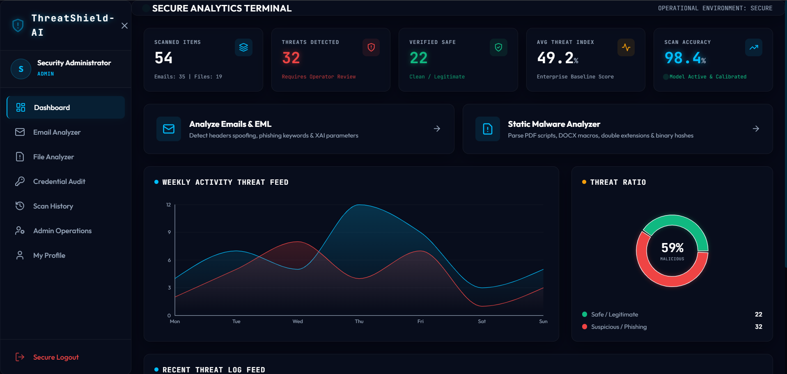

# 🛡️ AI-Based Phishing Detection & Malicious File Static Analysis Tool

<p align="center">
  
</p>

<p align="center">
  <strong>Modern AI-powered platform for phishing detection, static malware analysis, and enterprise threat monitoring.</strong>
</p>

<p align="center">
  
  
  
  
  
  
</p>

---

## 📖 Overview

ThreatShield-AI is a premium cybersecurity platform that combines **Machine Learning**, **Static Malware Analysis**, and **Threat Intelligence** into a single dashboard. It analyzes suspicious emails and uploaded files, detects phishing attempts, generates PDF reports, and provides administrators with a modern security operations center.

---

## ✨ Dashboard Preview

<p align="center">
  
</p>

### Dashboard Highlights

- 📧 AI Email & EML Analysis
- 📁 Static Malware Analyzer
- 📊 Live Threat Analytics
- 📈 Weekly Threat Activity Graph
- 🎯 Threat Ratio Visualization
- 👤 Secure Admin Panel
- 📄 PDF Report Generation
- 🔒 JWT Authentication
- 🛡️ Credential Audit
- 📜 Scan History & Logs

---

## 🚀 Quick Start

```bash
python run.py
```

This command automatically:

- ✅ Installs dependencies
- ✅ Creates the database
- ✅ Creates the administrator account
- ✅ Starts the Flask Backend
- ✅ Starts the React Frontend
